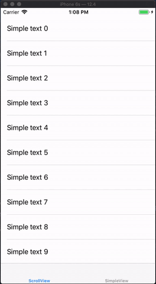

## Customizable PullToRefresh for any kind of view

[](https://travis-ci.org/Narek1994/NSVPullToRefresh)
[](https://cocoapods.org/pods/NSVPullToRefresh)
[](https://cocoapods.org/pods/NSVPullToRefresh)
[](https://cocoapods.org/pods/NSVPullToRefresh)

## Example

To run the example project, clone the repo, and run `pod install` from the Example directory first.



## Requirements
Swift 5.0
## Installation

NSVPullToRefresh is available through [CocoaPods](https://cocoapods.org). To install
it, simply add the following line to your Podfile:

```ruby
pod 'NSVPullToRefresh'
```

## Usage
import NSVPullToRefresh
```swift
import NSVPullToRefresh
```
In a simple case you will just need to add PullToRefresh to your main view, it will automatically handle child ScrollView(TableView,CollectionView), if there is one, without blocking other gestures added to the view.

```swift
view.addPullToRefresh { [weak self] in
    guard let strongSelf = self else {
        return
    }
    your code here
    DispatchQueue.main.asyncAfter(deadline: .now() + 2, execute: {
        strongSelf.view.hidePullToRefresh()
    })
}
```
⚠️ Don't forget to weakly capture ```self```, to avoid reference cycling!
for hiding just call 
```swift
hidePullToRefresh()
```
on that view.
## Creating custom PullToRefresh
Default it uses ```UIActivityIndicatorView```, for customizing you will need to create any ```UIView``` which will implement ```LoadingView``` protocol. You will need to specify ```size``` of refresher, ```topOffset```, and also implement ```startLoading``` and ```stopLoading``` methods. Optionally there is a ```speed``` property with default value of ```1```.
## Progress of Refreshing
You can get the progress of refreshing by adding this callback. It will give value from ```0``` to ```1```.
```swift
view.onProgress = { [weak self] progress in
    print(progress)
}
```
## Author
Narek1994, nareksimonyan94@gmail.com

## License

NSVPullToRefresh is available under the MIT license. See the LICENSE file for more info.
